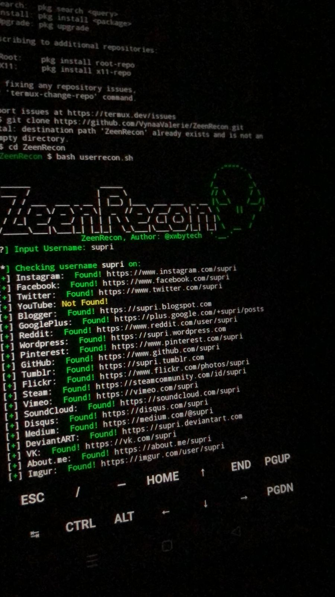

## ZeenRecon 
## UserRecon



### Author: thelinuxchoice  
### Rewritten by: xwbytech  
### Contributions by: Vynaa Valerie  

---

## Overview

**UserRecon** is a powerful reconnaissance tool designed to streamline the process of gathering user information from various platforms. With support for multiple operating systems, it provides an efficient solution for cybersecurity professionals and enthusiasts.

---

## Features

- **Cross-Platform Compatibility**: Tested on multiple operating systems, including:
  - Parrot OS
  - Kali Linux
  - Ubuntu
- **User-Friendly Interface**: Simple command-line interaction to gather user data effortlessly.
- **Rapid Information Retrieval**: Quickly gather information about users from various sources.

---

## Installation

To install **UserRecon**, follow these simple steps:

1. **Update your system:**
   ```bash
   apt update && apt upgrade
   ```

2. **Clone the repository:**
   ```bash
   git clone https://github.com/VynaaValerie/ZeenRecon.git
   ```

3. **Navigate to the UserRecon directory:**
   ```bash
   cd ZeenRecon
   ```

4. **Run the script:**
   ```bash
   bash userrecon.sh
   ```

---

## Usage

Once the installation is complete, simply execute the `userrecon.sh` script to start gathering user information. Follow the prompts to input the necessary details.

---

## Support

If you encounter any issues or have questions, feel free to open an issue on the [GitHub repository](https://github.com/VynaaValerie/ZeenRecon/issues).

---

## License

This project is licensed under the MIT License. See the [LICENSE](LICENSE) file for more details.

---

## Acknowledgements

- Special thanks to **thelinuxchoice** for the original concept of UserRecon.
- Thanks to **xwbytech** for the modifications and improvements.
- Appreciation to **Vynaa Valerie** for contributions and support.

---

## Disclaimer

This tool is intended for educational and ethical hacking purposes only. Please ensure you have permission before performing any reconnaissance on users or systems.
